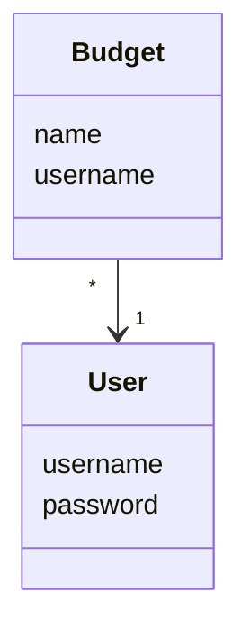

# Architecture

## Structure

Package diagram of the code:

The program consists of four main parts/directories:
- package *ui* contains user interface
- package *services* contains app logic
- package *repositories* contains saving information
- package *entities* contains source of information

## App logic

App logic's data model is formed by classes User and Budget.
Class User portrays users and Budget portrays budgets consisting the name of the budget and the creator of the budget.

