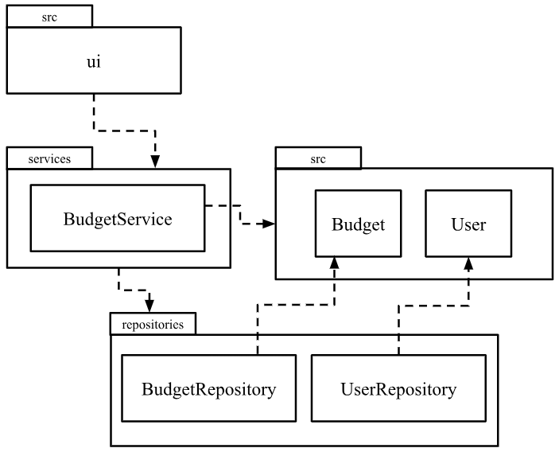
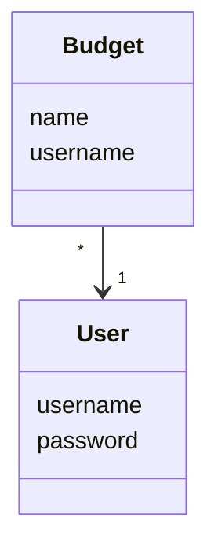
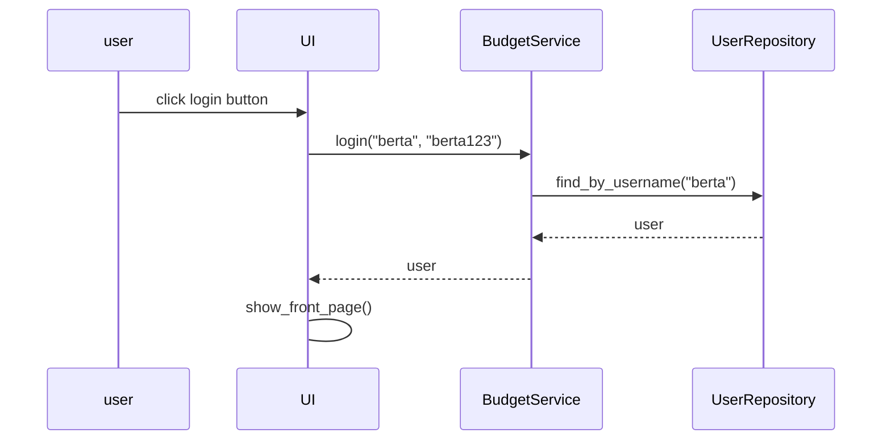

# Architecture

## Structure

Package diagram of the code:

The program consists of four main parts/directories:
- package *ui* contains user interface
- package *services* contains app logic
- package *repositories* contains saving information
- package *entities* contains source of information

## User interface

User interface contains four views:
- login & registeration
- front page
- budget view
- logout

These views have been created as their own classes. UI-class is responsible for showing these views. User interface only calls methods from BudgetService class, so it has been seperated from repositories.

## App logic

App logic's data model is formed by classes User and Budget.
Class User portrays users and Budget portrays budgets consisting the name of the budget and the creator of the budget.

## Main functionality

### User login

User writes username and password, and then clicks the login button.

