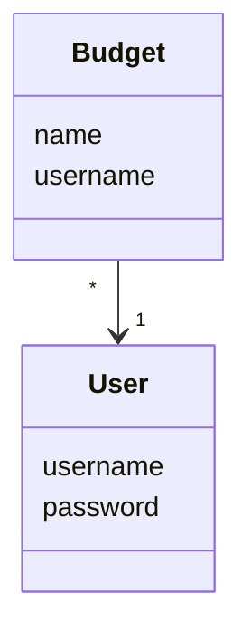
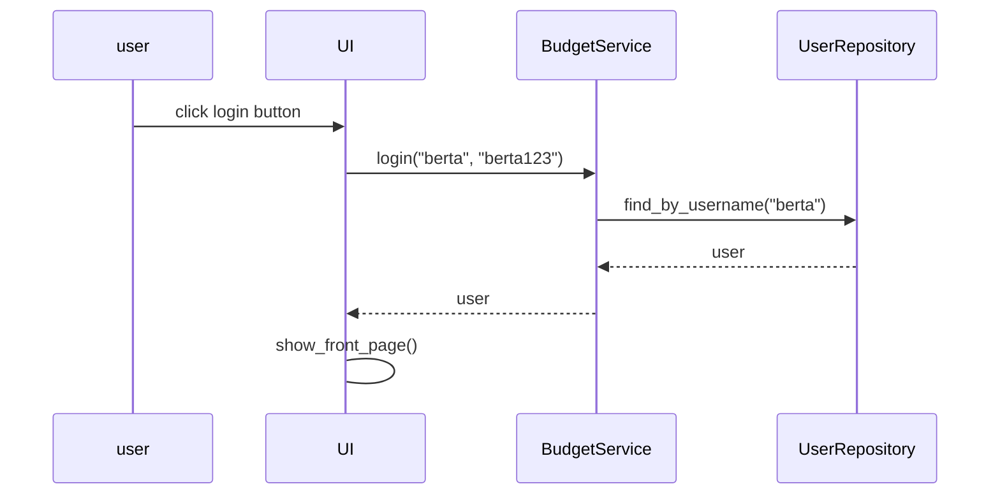
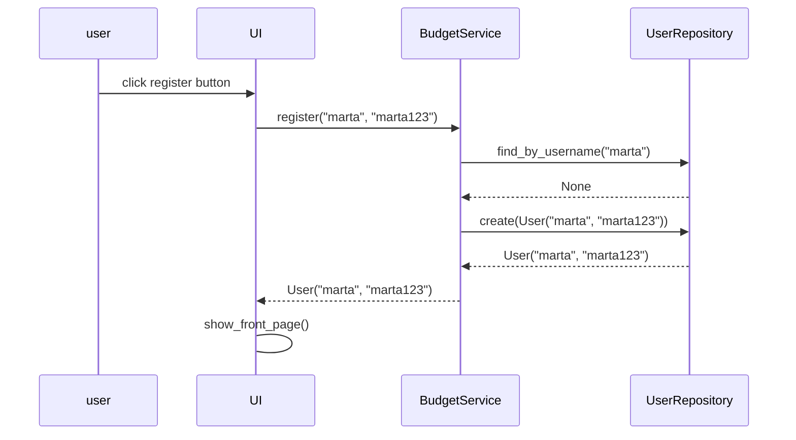
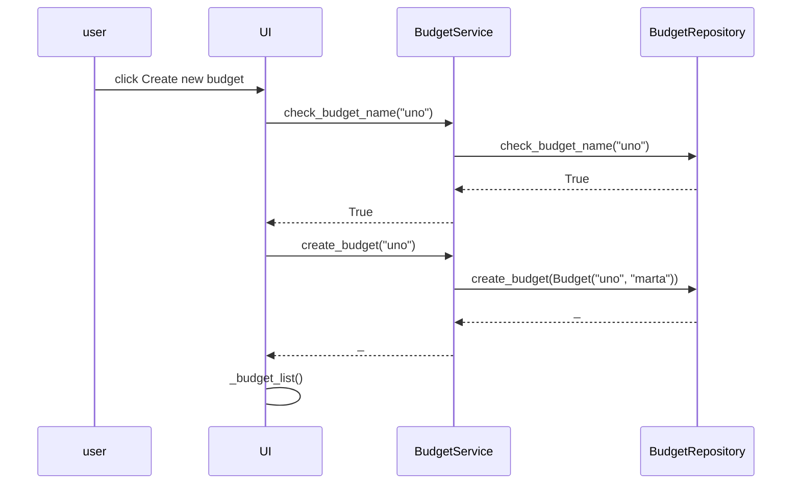

# Architecture

## Structure

Package diagram of the code:

The program consists of four main parts/directories:
- package *ui* contains user interface
- package *services* contains app logic
- package *repositories* contains saving information
- package *entities* contains source of information

## User interface

User interface contains four views:
- login & registeration
- front page
- budget view
- logout

These views have been created as their own classes. UI-class is responsible for showing these views. User interface only calls methods from BudgetService class, so it has been seperated from repositories.

## App logic

App logic's data model is formed by classes User and Budget.
Class User portrays users and Budget portrays budgets consisting the name of the budget and the creator of the budget.

## Saving information

Classes `UserRepository` and `BudgetRepository`, located in directory *repositories*, are responsible for saving information. User's username and password are saved in SQLite-database. Indormation about budgets are saved in CSV-file and SQLite-database; budget name and username are saved in CSV-file and all information about budgets (name, username, income, rent, groceries, hobbies) is saved to SQLite-database.

### Files

The app saves information in CSV-file and SQLite-database. In the [.env](https://github.com/eveliinaalikoski/ohte-harjoitustyo/blob/master/.env) -file, located in the root of the app, is defined the file names.

The app saves information to the CSV-file in the format of using semicolon (;) seperating values.

Information on the users is saved to table `users`, and information on budgets is saved to tables `budgets` and `topics`.

## Main functionality

### User login

User writes username and password, and then clicks the login button.

### Creating a user

User writes username and password, and then clicks the *register* button.

### Creating a budget

Logged in user ("marta") in front page writes a name for the budget in the input field and clicks *Create new budget* button. Let's assume that there is no budgets yet created (so the name is free).

