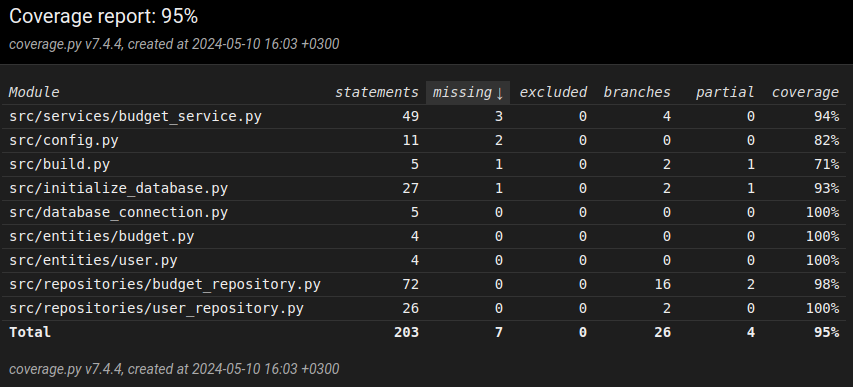

# Testing document

The program has been tested with Unittest.

## App logic

The class `BudgetService`, that is responsible of app logic, is being tested with the test class [TestBudgetService](https://github.com/eveliinaalikoski/ohte-harjoitustyo/blob/master/src/tests/budget_service_test.py). `BudgetService` -object is initialized so that it has repository-objects as dependencies. For this reason in tests there is `BudgetRepositoryTests` and `UserRepositoryTests` in use.

## Repositories

Repository classes `BudgetRepository` and `UserRepository` are being tested with test classes [TestBudgetRepository](https://github.com/eveliinaalikoski/ohte-harjoitustyo/blob/master/src/tests/repositories/budget_repository_test.py) and [TestUserRepository](https://github.com/eveliinaalikoski/ohte-harjoitustyo/blob/master/src/tests/repositories/user_repository_test.py). Repository classes are only tested with test files, which are configured in file [.env.test](https://github.com/eveliinaalikoski/ohte-harjoitustyo/blob/master/.env.test)

## Test coverage

The test's branch coverage of the app is 95%. User interface not included in the tests

Remained untested:
- executing files *initialize_database.py* and *build.py* from the command line
- from file *budget_service.py* functions *get_budget_info* and *update_budget*
