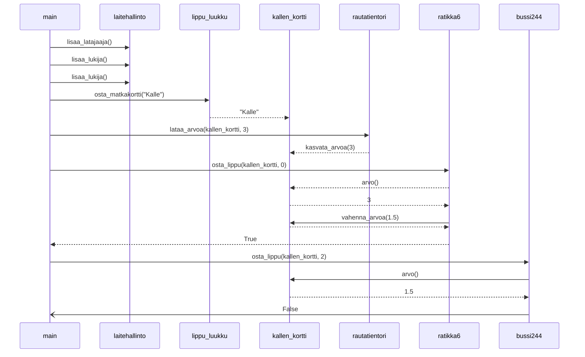

## HSL

```mermaid
sequenceDiagram
    main ->> laitehallinto: lisaa_latajaaja()
    main ->> laitehallinto: lisaa_lukija()
    main ->> laitehallinto: lisaa_lukija()
    main ->> lippu_luukku: osta_matkakortti("Kalle")
    lippu_luukku -->> kallen_kortti: "Kalle"
    main ->> rautatientori: lataa_arvoa(kallen_kortti, 3)
    rautatientori -->> kallen_kortti: kasvata_arvoa(3)
    main ->> ratikka6: osta_lippu(kallen_kortti, 0)
    ratikka6 -->> kallen_kortti: arvo()
    kallen_kortti -->> ratikka6: 3
    ratikka6 ->> kallen_kortti: vahenna_arvoa(1.5)
    kallen_kortti -->> ratikka6:
    ratikka6 -->> main: True
    main ->> bussi244: osta_lippu(kallen_kortti, 2)
    bussi244 ->> kallen_kortti: arvo()
    kallen_kortti -->> bussi244: 1.5
    bussi244 -) main: False
```